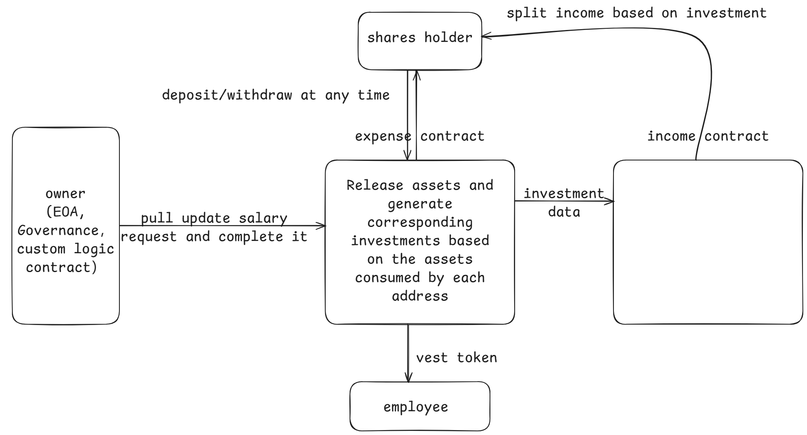

# Creator-Market
This smart contract protocol attempts to build a decentralized company, describing human collaboration relationships through smart contracts, incorporating value production into the blockchain, and facilitating the deconstruction, splitting, and decentralization of the company.

Smart Contract Image：

smart contract usage:

clone folder "contracts" to Remix

deploy contract MyToken

deploy contract Vesting4626

	owner_ = test wallet (0x5B38Da6a701c568545dCfcB03FcB875f56beddC4)

	token_ = contract MyToken address

deposit:

	call MyToken.approve, spender = contract Vesting4626 address, value = 1e20

	call Vesting4626.deposit, assets = 1e18, receiver = test wallet (0x5B38Da6a701c568545dCfcB03FcB875f56beddC4)

update salary:

	call Vesting4626.updateSalary, creator_ = test wallet (0xAb8483F64d9C6d1EcF9b849Ae677dD3315835cb2), amount = 1e18

	call Vesting4626.finishUpdate, creator_ = test wallet (0xAb8483F64d9C6d1EcF9b849Ae677dD3315835cb2)

TODO：
1. - [x] permit
2. - [x] Math
3. - [x] front-end

