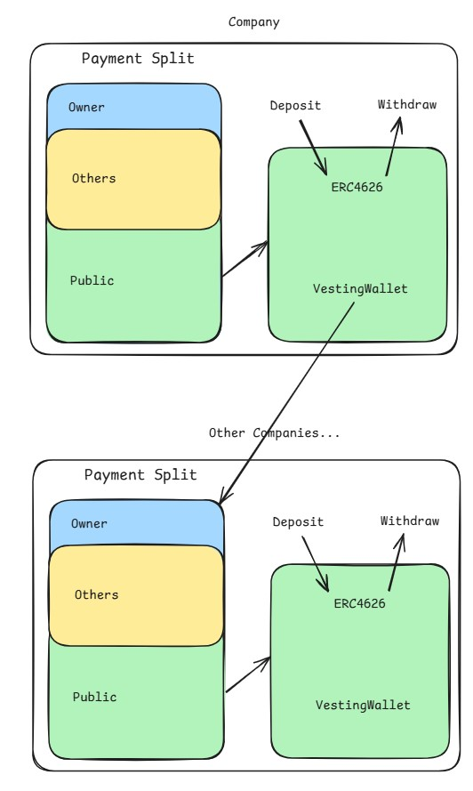

# Creator-Market
This smart contract protocol attempts to build a decentralized company, describing human collaboration relationships through smart contracts, incorporating value production into the blockchain, and facilitating the deconstruction, splitting, and decentralization of the company.

Build a decentralized version of Patreon, Steam, and YouTube.

Smart Contract Image：

smart contract usage:

clone folder "contracts" to Remix

front-end usage:

  install：
  
  `npm install`
  
  run:
  
  `npm run dev`

TODO：
1. - [x] permit
2. - [x] Math
3. - [x] front-end
4. - [ ] front-end Storage
5. - [ ] useLocation

